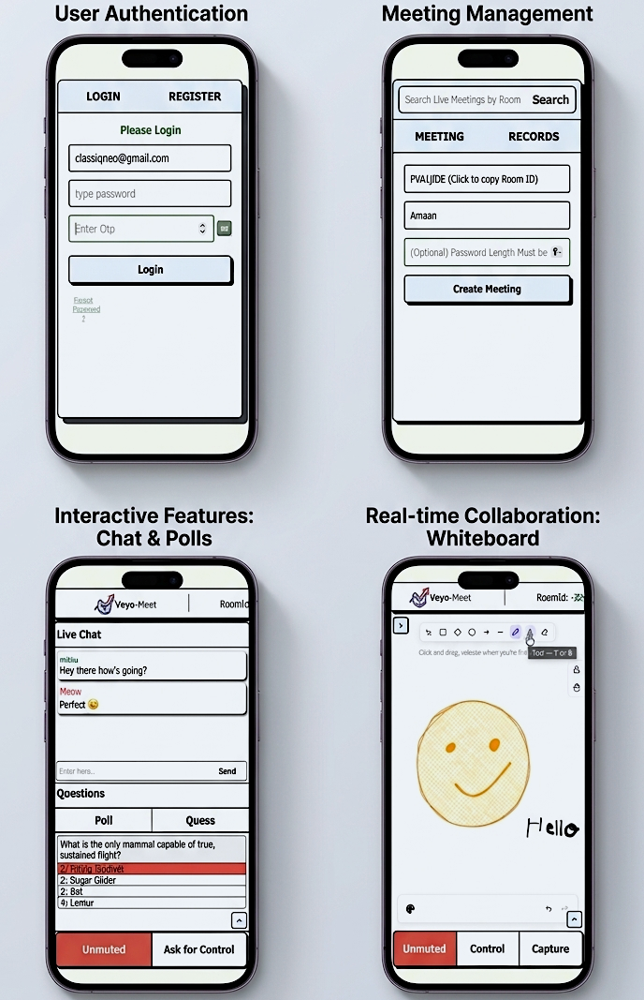
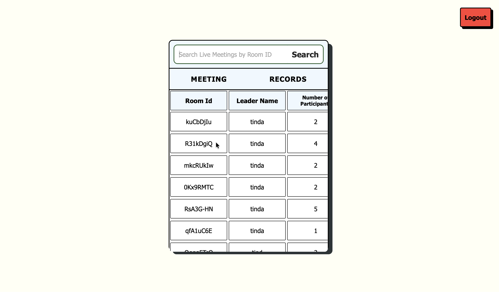
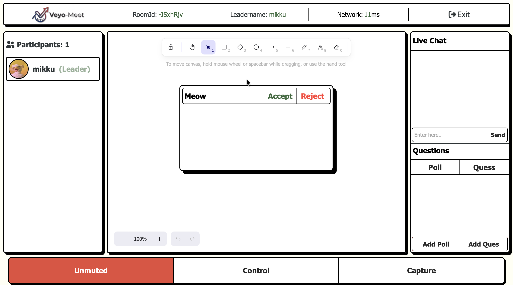
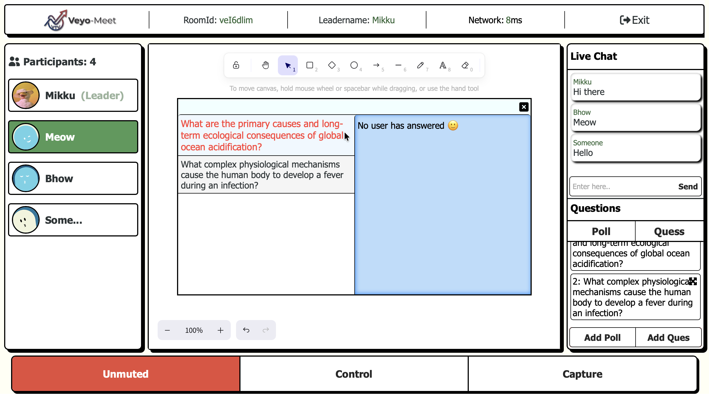

# Veyo Meet

A full-stack real-time collaboration app where users can join meetings, communicate through voice, and collaborate on a shared canvas—all synchronized instantly across participants.

---

## Project Overview

After building my first full-stack application, I wanted my next project to be something that would push me much further. Instead of building another CRUD application, I wanted to understand how real-time applications actually work when multiple people use them at the same time.

That idea became Veyo Meet.

It combines voice communication with a collaborative canvas where everyone in the meeting can draw together while every change is synchronized instantly.

This project taught me things that I hadn't worked with before, like Socket.io, backend state management, authentication, collaborative applications, and real-time synchronization. As I learned more, I kept redesigning parts of the project instead of settling for the first solution, so the final application looks very different from where I started three months earlier.

---

## AI Assistance Disclosure

I built Veyo Meet over roughly three months. During development, I occasionally used AI whenever I got stuck on problems that were completely new to me.

AI mainly helped me with:

- understanding and implementing the voice chat feature
- debugging difficult frontend and backend issues
- understanding a few complex SQL queries

Voice chat is the only feature that relied heavily on AI. I originally spent several days trying to solve audio echo and feedback problems on my own before realizing I was out of my depth. Instead of giving up on the feature, I used AI to understand how the implementation worked and then integrated it into my own project.

The rest of the project—including the application idea, meeting system, collaborative canvas, authentication, backend APIs, Socket.io events, database design, and overall project structure—was planned and developed by me.

<p align='center'>

</p>
<p align='center'>

</p>
<p align='center'>

</p>
<p align='center'>

</p>
<p align='center'>

</p>

## Features

| Feature | Description |
|---------|-------------|
| User Authentication | Users can create an account, log in securely, and access only the meetings they are allowed to join. Passwords are hashed using bcrypt and authentication is handled with JWT. |
| Meeting Rooms | Users can create a new meeting or search for an existing live meeting using its meeting ID. |
| Collaborative Canvas | Every participant can draw on the same whiteboard, and the drawings appear for everyone almost instantly. |
| Voice Communication | Participants can talk with each other through voice while staying inside the meeting. |
| Live Chat | Send and receive messages during the meeting without leaving the collaboration screen. |
| Poll System | Create polls during a meeting and see the results update as participants vote. |
| Question & Answer | Ask questions, collect responses from participants, and view both the response percentage and the names of people who have answered. |
| Canvas Permissions | The meeting leader can share drawing access with another participant or take control back whenever needed. |
| Canvas Capture | Save the current state of the whiteboard as an image for future reference or sharing. |
| Meeting Resources | Files and resources shared during a meeting can still be downloaded after the meeting has ended. |
| Real-Time Synchronization | Canvas drawings, chat messages, polls, questions, permissions, and other meeting events stay synchronized across all connected participants using Socket.io. |

## Why I Built Veyo Meet

During and after the COVID-19 pandemic, online classes became a normal part of my education. Whenever schools were closed because of holidays or unexpected situations, classes often continued through online meetings.

Although online classes kept learning going, I personally struggled with them. If the network became unstable or the audio started breaking, it was easy to miss an important explanation. For subjects where teachers were solving problems or drawing diagrams, I always felt that seeing the explanation mattered more than seeing the teacher.

That experience gave me the idea for Veyo Meet.

Instead of focusing on video calls, I wanted to explore a different approach where people could talk through voice while working together on a shared canvas. Even if someone missed a few seconds of audio, the explanation was still visible on the board.

At the same time, I wanted to challenge myself by building a real-time application instead of another traditional CRUD project.


## Challenges I Faced

Building a real-time application was much harder than I expected.

The collaborative canvas caused a lot of problems because bugs usually didn't appear until multiple people joined the same meeting. A feature would work perfectly when I tested it alone, then suddenly break when two or three users interacted with the canvas at the same time. Finding those bugs took much longer than writing the feature itself.

Voice chat was the hardest part of the project. I spent almost three days trying to fix audio echo and feedback issues. At one point I even replaced large parts of the implementation after following AI suggestions, only to find out later that many of the problems came from testing multiple microphones on the same computer. That experience taught me that debugging sometimes starts with questioning your testing setup instead of assuming the code is wrong.

Designing the database was another challenge. Before this project, I had only worked with relatively small databases. Managing meetings, participants, authentication, screenshots, and room state forced me to think much more carefully about how the data should be organized.

Looking back, I probably spent more time debugging and redesigning features than actually writing new ones.

## What I Learned

This project taught me much more than how to use new libraries.

I learned how Socket.io can be used for much more than sending chat messages. By the end of the project, I was using it to synchronize drawings, polls, meeting events, questions, permissions, and other shared state between multiple users in real time.

I also became much more comfortable working with PostgreSQL. Planning the database, writing SQL queries, and deciding how different parts of the application should relate to each other was one of the hardest parts of the project because I had very little experience with databases before this.

Building Veyo Meet also introduced me to technologies that were completely new to me, including collaborative canvas synchronization, JWT authentication, password hashing, voice communication, and integrating multiple third-party services into one application.

More than anything else, this project changed the way I solve problems. Earlier I expected to know the solution before I started. Now I'm much more comfortable reading documentation, experimenting, breaking things, and gradually improving the implementation until it works.

## Setup

Follow these steps to run Veyo Meet locally.

### 1. Clone the repository

```bash
git clone https://github.com/mohdamaan0027/veyo-meet.git
cd veyo-meet
```

---

### 2. Install dependencies

Backend

```bash
cd backend
npm install
```

Frontend

```bash
cd ../frontend
npm install
```

---

### 3. Configure environment variables

Create a `.env` file inside the **backend** folder.

```env
PORT=3000

DB_USER=postgres
DB_PASSWORD=your_postgresql_password
DB_HOST=localhost
DB_PORT=5432
DB_DATABASE=meeting

JWT_SECRET=your_jwt_secret
JWT_EXPIRES_IN=7d

CLOUDINARY_CLOUD_NAME=your_cloudinary_cloud_name
CLOUDINARY_API_KEY=your_cloudinary_api_key
CLOUDINARY_API_SECRET=your_cloudinary_api_secret

EMAIL_USER=your_email_address
EMAIL_PASSWORD=your_email_app_password
```

Create another `.env` file inside the **frontend** folder.

```env
VITE_BACKEND_URL=http://localhost:3000
```

---

### 4. Create the PostgreSQL database

```sql
CREATE DATABASE meeting;
```

Connect to the database and create the required tables.

```sql
CREATE TABLE users (
    id SERIAL PRIMARY KEY,
    email VARCHAR(255) UNIQUE NOT NULL,
    password_hash TEXT NOT NULL,
    is_verified BOOLEAN DEFAULT FALSE,
    created_at TIMESTAMP DEFAULT CURRENT_TIMESTAMP,
    updated_at TIMESTAMP DEFAULT CURRENT_TIMESTAMP,
    socket TEXT,
    rooms INTEGER[] DEFAULT '{}'
);

CREATE TABLE rooms (
    id SERIAL PRIMARY KEY,
    room_id VARCHAR(10),
    password VARCHAR(8) DEFAULT '12345678',
    participants JSONB DEFAULT '[]'::jsonb,
    screenshots JSONB DEFAULT '[]'::jsonb,
    leader VARCHAR(255),
    leadername TEXT,
    live BOOLEAN DEFAULT TRUE,
    leadersocket TEXT,
    live_chat JSONB,
    created_at TIMESTAMP DEFAULT CURRENT_TIMESTAMP
);
```

---

### 5. Start the backend

```bash
cd backend
npm start
```

---

### 6. Start the frontend

```bash
cd frontend
npm run dev
```

---

### 7. Open the application

Visit

```
http://localhost:5173
```

Create two accounts (or open two browser windows) to test meeting creation, real-time canvas synchronization, voice communication, chat, and collaborative features.

## Repository Note

This repository preserves the project's development history over approximately three months, including feature additions, bug fixes, and iterative improvements made throughout the development process.

## Author

**Mohd Amaan**

GitHub: https://github.com/mohdamaan0027

Thank you for taking the time to explore this project.